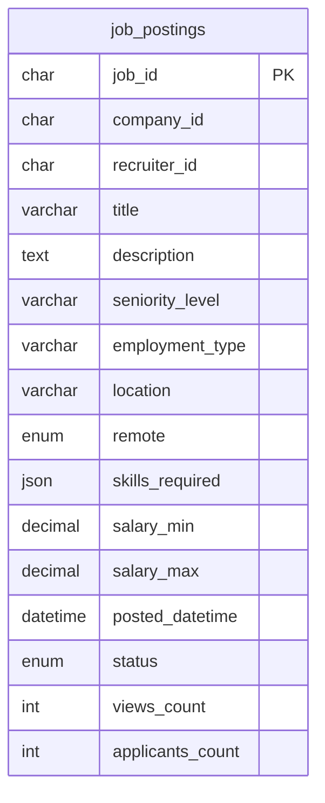

# Job Service & Job UI — user stories (Week 0 story map)

Rough XP uses a1–5 scale (1 = trivial, 5 = multi-service / risky).

## Member — discover and save jobs

| Story | Acceptance (summary) | XP |
|-------|----------------------|-----|
| As a **member**, I can **search jobs** by keyword and location so I can find relevant roles. | `POST /jobs/search` returns paginated results; filters applied; UI shows LinkedIn-style list + detail. | 5 |
| As a **member**, I can **open a job detail** view so I can read the full description. | Route `/jobs/:id`; loads job; `job.viewed` tracked (W3+) with shared `trace_id`. | 3 |
| As a **member**, I can **save a job** so I can apply later. | Save toggles UI; `job.saved` emitted (W3+); persistence via team’s saved-jobs strategy. | 4 |

## Recruiter — manage postings

| Story | Acceptance (summary) | XP |
|-------|----------------------|-----|
| As a **recruiter**, I can **create a job posting** so candidates can apply. | `POST /jobs/create`; validation; row in MySQL; `job.created` (W2+). | 5 |
| As a **recruiter**, I can **edit my posting** so information stays accurate. | `POST /jobs/update`; ownership check (403); dirty-field guard. | 4 |
| As a **recruiter**, I can **close a posting** so no new applications are accepted. | `POST /jobs/close`; status `closed`; coordinate with M3 (409 on apply); `job.closed`. | 5 |
| As a **recruiter**, I can **see all my jobs** in one place. | `POST /jobs/byRecruiter`; management table UI with status badges. | 3 |

## Schema diagram (`job_postings`)

_Foreign keys to `companies` / recruiters (or members) are deferred until those tables exist._

## Dependencies on other members

- **M1:** routing shell, design tokens, Kafka envelope standard.
- **M3:** closed-job guard and `application.submitted` consumer coordination.
- **M6:** analytics ingestion for `job.*` events.
- **M7:** Docker Compose, Redis (later weeks).
